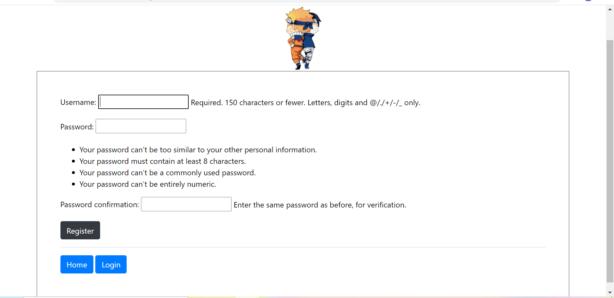

<h2>Naruto Fandom</h2>

<b>Introduction</b> - Naruto Fandom is a web app made using Django as the main framework, with Python on the back-end and Java on the fron-end. It is made keeping in mind the Naruto fan's community who would love to come together and interact with each other through various posts and be a part of the community. 

<h3>Languages And Tools Used :</h3> 
<b>HTML5, CSS3, Python, Django, Java, VS Code, SQLite3</b>

<h2><b>Project Structure:</b></h2>

<h3>Home Page:</h3>

On the home page you can find the list of all the articles that have been published by the various users till now. Click on any article you would to give a read and enjoy.
Here is an example of the <b>Home Page</b>

Here on the home page you can see all the articles along with the name of the authors. Click on any of the article you would like to give a read and dwell into the Naruto Universe.

Here you can see how the post looks like:

Did you enjoy reading the post? Why not give a like to the post and motivate the author to write more posts like this? But wait, you need to login before you can like a post. You can find the login button in the nav-bar or just below the post itself.

Are you not a registered user? Don't worry, we've got you covered. You can find the register button just below the login form or on the home page.

Register yourself and then login to access all the features this FANDOM has to offer you.
After you login in, take a good look at the nav-bar. Now you can add a new post.

Not satisfied with your content? Don't worry, you can always go back and edit your post. This allows user to keep their post upto date with the latest information rather than creating a new post every single time just to tweak little information.

There might be situation when you would like to delete your post completely rather than editing. You can also do that by cliking on the delete button just below your post.

However, you might be worried that anyone who is a part of the community can edit and delete your post. To counter this it is made sure that no one other than the author of the post is allowed to EDIT or DELETE the post.
 
Other feature of the website includes a Dashboard:

<h2>Files and directories</h2>
<ul>
  <li>fandom - Main Application Directory.</li>
  <li>finalproject - Project Directory.</li>
  <li>members - Application Directory For Holding All The Users.</li>
  <li>screenshots - It contains screenshot samples of the different features of the web application.</li>
</ul>

<h3>fandom</h3>
<ul>
  <li>models.py - here I added a model named Post which contains all the data related to a post like author's name, title, likes, date of creation and other important information</li>
  <li>admin.py - gave access to the <b>Super Admin</b> to control everything to a post which exists on the website.</li>
  <li>urls.py - added different URLs to create a link between all the pages.</li>
  <li>views.py - added different classes and functions which allow user to login, register, logout, add post, like a post and many more features which are available.</li>
  <li>templates - contains all application templates
    <ul>
      <li>add_post.html - template for adding new post if you are logged in.</li>
      <li>article_details.html - template for viewing a complete post.</li>
      <li>dashboard.html - template for viewing dashboard if you are logged in.</li>
      <li>delete_post.html - template for deleting a post if you are the author of the post.</li>
      <li>home.html - template for the main page of the web application from where you can access other pages.</li>
      <li>login.html - template for login page.</li>
      <li>register.html - template for registration page.</li>
      <li>update_post.html - template for updating a post if you are the author of the post.</li>
    </ul>
  </li>
  <li>static/fandom - contains all the css files.
    <ul>
      <li>dashboard.css - styling file for dashboard page.</li>
      <li>home.css - styling file for home page.</li>
      <li>login-register.css - styling file for login and registration page.</li>
    </ul>
  </li>
</ul>

<h3>members</h3>
<ul>
  <li>urls.py - here I added a link for registrating a new user.</li>
  <li>views.py - created a class USerRegisterView for creating a form for registration of a new user.</li>
  <li>templates - contains all application templates
    <ul>
      <li>login.html - template for login page.</li>
      <li>register.html - template for registration page.</li>
    </ul>
  </li>
</ul>

